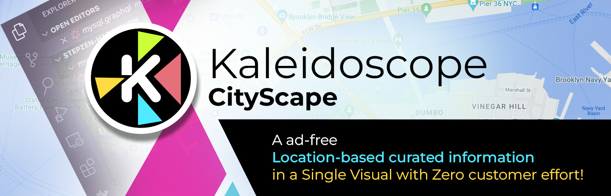
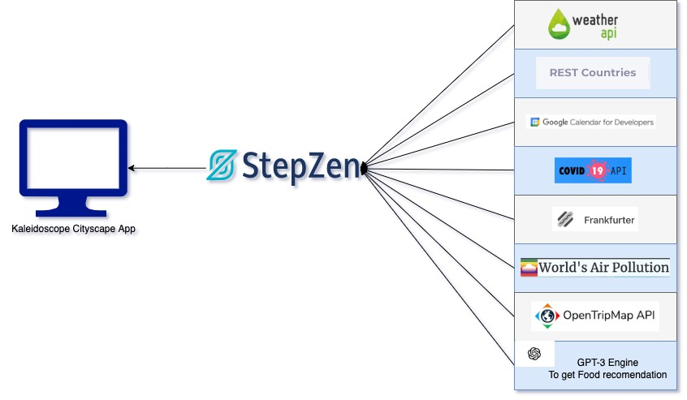

## Inspiration

Getting information while being on the go from several sources at the same time is often a need without having to go through a plethora of apps. It becomes especially hard for  one to get an ad-free experience through several data sources that may drive one's decisions in a given location. It has happened several times with me, where I have not been aware of the local holidays, good local cusines or public places to visit. Getting access to this kind relevant information in a glance is something that would be very handy, especially during short business trips.

*There are many sources of location-based data but not **one visual with all relevant data for a location***
## What it does
**Kaleidoscope @ CityScape** aims at bringing a *location-based strategy of curating information* for the user in a frictionless manner. **No advertisements! No Login !** Just information curated about your current location.

The product aims at curating information to capture the following data points in a visually appealing manner for the user on the web or mobile
1. Pollution
2. Weather
3. COVID
4. Local currency
5. Time zone
6. Local holidays
7. Places of Interest
8. Foods of Interest

## How we built it
In order for us to start building this out, we first focused on our team composition. Our team is composed of four people. We onboarded skills in UX, back-end, and front-end. We combined that into a product idea that led us to the development of **Kaleidoscope @ CityScape**.

We followed the standard practices of identifying two key elements:

 1. User Experience by developing prototypes in Figma
 2. Research & Identification of API infrastructure that will help us curate relevant information for the product

We have used open-source and/or free-tier API infrastructure to source our information whilst putting GraphQL as a schema first design for front-end:
 - [Pollution](https://aqicn.org/api/)
 - [Weather](https://www.frankfurter.app/)
 - [COVID](https://documenter.getpostman.com/view/11144369/Szf6Z9B3?version=latest#ec0c31aa-b666-4603-8d35-900932206384)
 - [Local currency](https://restcountries.com/)
 - [Time zone](https://restcountries.com/)
 - [Local holidays](https://dev.to/monfernape/get-country-holidays-using-google-calendar-api-3dh6)
 - [Places of Interest](https://opentripmap.io/tiles)
 - [Foods of Interest](https://beta.openai.com/examples/default-factual-answering)
 
 

## Challenges we ran into
There are three key challenges that we had to face in order to bring **Kaleidoscope @ CityScape** to life:
 - **API research & trials**
 Picking the first available API for seeking our data points was not the approach we could use. This process involved for us to go through a research methodology of creating a test funnel based on the following parameters
	- Richness of information available
	- API responsiveness
	- API tier ( open source, free tier & / or only commercial )
	- Ability to drive information look-up through upper-funnel location information
 - **Accurate location algorithm**
We do not rely on one single way of seeking the correct location of the user. We have taken into consideration solving for advertisement and location blocking mechanisms in browsers in order to build a waterfall algorithm that must return a location at all times. It uses the following sources in decreasing priority:
    - FingerprintJS
    - Browser GeoLocation API
    - IP Geolocation
 - **Foods of Interest**
It is not easy to get this information, as usually this is captured via user experiences in hard-to-parse ways or entailed through non-API-based interfaces. We solved this problem by using an Open- AI GPT-3 trained model to seek actual information by providing location-based data and then applying simple NLP tokenization in order to get relevant foods of interest.

## Accomplishments that we're proud of
The whole team is excited to learn GraphQL as a first pass and also explore ways of using AI-based techniques in enriching location information. We think that we have truly put the technology to use by abstracting the front-end from complex orchestration of API infrastructure and moved it to schema first approach thus providing for a cleaner front-end developer approach.

We are happy to see that our user experience, schema first design & back-end all has come together to create a **No advertisements! No Login !** web app that provides curated data for your current location!

## What we learned
-   Stepzen CLI comes handy in order to create Graphql schemas for any rest end point using import command.
-   Stepzen playground is a developer friendly way to deploy & test Graphql endpoint in a jiffy.
-   Directives
	- @matrerializer : Used to fetch cascaded information using country / lat / long to get data from different API. No need to write custom resolvers.
	- @rest : TransformRest Property: This has helped in transforming the API response before stepzen api responds the data as the ultimate result.
	- @sequence : Used to fetch derived synchronous API e.g. get GcalCode for a country & then Holidays using that Gcal code.
  - `transformREST`: Takes away the need for building custom transformers using Server Side Code.

## What's next for Kaleidoscope @ CityScape
We can achieve two more aspects of curation:
1. Develop a recommendation schema that can present our information via GraphQL interfaces and power context-based personalization enabled through macro factors as part of the user journey
2. Release more **Kaleidoscope** information schema that can power stock, news, and stories

# Development

This app is a representation of how the front end could consume graph-ql API to reduce the excess payload information responded by API. The code base uses various open-source APIs to collate the information of a place where the user is present and pull the information by creating a graph of graph endpoint. [Stepzen](https://stepzen.com/) is the tool used in the backend to host the graph-ql API.

## Available Scripts

In the project directory, you can run:

### `npm run stepzen-login`

Runs interactive CLI to loin into stepzen account using API key & account

### `npm run start`

Runs the app in the development mode.\
Open [http://localhost:3000](http://localhost:3000) to view it in the browser.

Runs the Stepzen playgound on locla machine responding to the config hosted in Stepzen folder.\
Open [http://localhost:5001/api/place-kaleidoscope](http://localhost:5001/api/place-kaleidoscope) to view it in the browser.

The page will reload if you make edits.\
You will also see any lint errors in the console.
